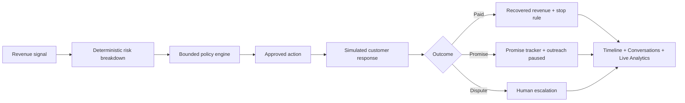

# Sambhaash Recovery — AI Revenue Recovery

> Detect revenue at risk → diagnose the cause → choose a bounded action → recover or escalate → prove the outcome.

Sambhaash Recovery is a demo-ready revenue-recovery agent built for Track 03. It focuses on the full decision loop rather than a dashboard of unconnected features: an explainable risk score creates a policy-bound recovery case, a simulated multilingual conversation produces a customer outcome, and the resulting recovery, stop rule, escalation, audit trail, Conversations entry, and analytics update from the same stateful workflow.

## What is actually implemented

- Stateful FastAPI recovery engine with deterministic scoring and policy rules.
- B2B receivables flagship flow: approved outreach, promise-to-pay, payment confirmation, dispute escalation, and stopping rules.
- Browser-based Hinglish recovery dialer with a clearly labelled simulated transcript. It never places a real call.
- Conversations page populated by simulated-call outcomes.
- Live analytics that reflect the current demo run, separate from the synthetic batch benchmark.
- Scenario Lab for checkout abandonment, failed subscriptions, and mandate-retry recovery. Each launches a real case in the same engine.
- Resettable fictional demo data, backend policy tests, and a production frontend build.

## 60-second judge demo

1. Open **Dashboard → Run golden demo** and choose Aarav Mehta (₹84,500 at risk).
2. Show the risk-score breakdown, diagnosis, and approved action.
3. Open the recovery dialer and select **“Payment complete ho gaya”**.
4. Show the case is `RECOVERED`, recovered revenue is ₹84,500, and further outreach is stopped.
5. Open **Conversations** to show the saved call outcome and next action.
6. Open **Analytics** to show the same live recovered amount.
7. Optionally open **Scenario Lab** to launch checkout, subscription, or mandate-retry cases through the same engine.

## Explainable risk score

The score is deterministic, capped at 100, and stored with its full breakdown. No LLM can override this score or the downstream policy.

| Contribution | Points |
|---|---:|
| Event severity: payment failure / checkout abandonment / invoice dispute | +20 / +10 / +25 |
| Days overdue | `min(30, days × 1.5)` |
| Amount tier: ≥₹75k / ≥₹40k / ≥₹10k | +29 / +20 / +10 |
| Prior failed attempts | +8 each, capped at +16 |
| Previous promise missed | +15 |
| Historical payment delay | +8 |
| Low responsiveness | +8 |

For example, a ₹14,900 failed subscription with no overdue days is `20` event-severity points plus `10` amount-tier points: **30/100**. The UI shows every contribution—including zero-value ones—to make the decision auditable.

## Policy boundaries

- Maximum automated attempts: **3**
- Maximum voice calls per day: **1**
- Stop automated outreach after payment, opt-out, or a valid promise-to-pay
- Escalate invoice disputes, failed promises, repeated failures, and high-value cases
- Deterministic policy owns payment state, limits, and escalation; AI may assist with language or classification but cannot bypass rules

## Architecture



## Demo data and measurement integrity

All invoice, customer, phone, call, and outcome records bundled with this project are fictional. A simulated call is explicitly labelled as such and does not claim a telephony integration.

The **Live Demo Outcomes** section reflects actions taken in the current in-memory run. The **Synthetic Batch Benchmark** compares a generic-reminder baseline with the bounded workflow across the seeded nine-invoice batch. It is an assumption model calculated in code, not a claim about real merchant outcomes.

## Run locally

Requirements: Python 3.10+ and Node.js **20.19+** (or newer).

```bash
# Terminal 1: backend
cd Backend
python -m pip install -r requirements.txt
python -m uvicorn main:app --host 127.0.0.1 --port 8000

# Terminal 2: frontend
cd Frontend
npm install
npm run dev
```

Open the Vite URL shown in the terminal, then visit `/dashboard/recovery`.

## Verify

```bash
cd Backend
python -m pytest tests/test_recovery_engine.py -q
python scripts/run_recovery_benchmark.py
python scripts/verify_recovery_demo.py

cd ../Frontend
npm run build
```

## Demo API surface

- `GET /api/recovery/summary` — live demo metrics
- `GET /api/recovery/cases` — recovery cases
- `POST /api/recovery/cases/{id}/execute` — approved action
- `POST /api/recovery/cases/{id}/simulate-call` — simulated call outcome + Conversations record
- `GET /api/recovery/call-summaries` — simulated call records
- `GET /api/recovery/scenarios` and `POST /api/recovery/scenarios/{id}/activate` — Scenario Lab
- `POST /api/recovery/demo/reset` — reset only the fictional in-memory dataset

## Production path

The current adapter is intentionally in-memory for a reliable no-credential demo. A production implementation would persist cases and audit events, authenticate users, receive verified payment webhooks, use consented communication channels, and retain only the minimum required customer data.
