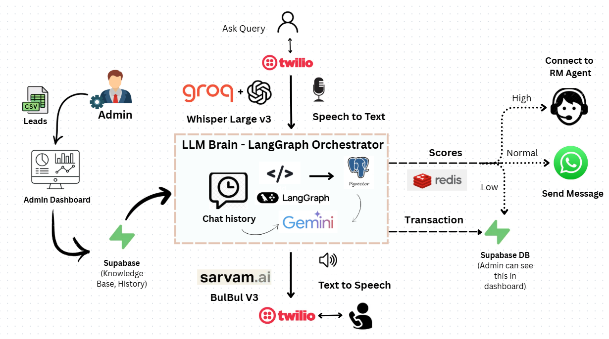

# Sambhaash AI — AI Revenue Recovery

> **DETECT → DIAGNOSE → DECIDE → ACT → RECOVER**

Sambhaash AI is an AI receivables-recovery agent for overdue B2B invoices. It detects revenue at risk, identifies a bounded payment cause, chooses an approved intervention, and executes a multilingual voice or WhatsApp recovery workflow. A valid promise-to-pay pauses outreach; a failed promise, repeated failures, or a high-value invoice trigger controlled human escalation.

## Track 03 demo

The project includes a **clearly labelled fictional, offline-capable demo batch** of nine invoices totalling **₹18,40,000 at risk**. No live database, model, Twilio, Sarvam, or WhatsApp credentials are required for the core Track 03 walkthrough.

1. Open `http://localhost:5173/dashboard/recovery`.
2. Open **Aarav Mehta / INV-2026-1042**: ₹84,500, 18 days overdue, risk 87/100, cause `approval delay`.
3. Execute its approved WhatsApp + payment-link action.
4. Simulate: `Friday ko payment kar denge.` The app records the promise, schedules the next action, and stops automation.
5. Simulate payment confirmation. The case becomes recovered and ₹84,500 is visible as recovered revenue.
6. Open **Benchmark** to compare the calculated Sambhaash workflow with the generic-reminder baseline.

## Bounded workflow rules

- Maximum automated attempts: **3**
- Maximum voice calls per day: **1**
- Stop on payment, valid promise-to-pay, or opt-out
- Escalate after repeated failures, failed promise-to-pay, or high-value invoice
- The LLM may classify or draft text, but backend rules own payment status, limits, and escalation

## Benchmark

The synthetic benchmark is calculated in code from the same fictional records. The baseline is one generic reminder; Sambhaash applies deterministic risk scoring, diagnosis, an approved intervention, and bounded stopping rules. It reports invoices evaluated, amount at risk, recovered amount, recovery rate, average contacts, escalation count, promise count, and net recovered value. It is an assumption model, not a claim about real merchant outcomes.

## Technology reused

React, FastAPI, Supabase/Postgres, LangGraph, the existing scoring and RAG/pgvector paths, Celery/Redis, Twilio, WhatsApp, Whisper, Groq, and Sarvam voice remain part of the architecture. The new recovery module is deliberately small and can map its demo adapter to the existing repository/database layer for production.

## Run the Track 03 demo

```bash
# Backend (from Backend/)
python -m pytest tests/test_recovery_engine.py -q
python scripts/run_recovery_benchmark.py
python -m uvicorn main:app --reload

# Frontend (from Frontend/)
npm install
npm run dev
```

For deployment, configure `CORS_ORIGINS` and `TRUSTED_HOSTS` with the actual frontend and backend hostnames. Wildcard CORS/trusted-host defaults have been removed.

The case page also contains clearly labelled offline simulation controls for
payment confirmation, a Hinglish promise-to-pay, an invoice dispute, payment
failure, and no response. Each outcome is recorded in the case timeline and
evaluated against the same backend recovery policy.

---


#  Sambhaash AI

> A Premium Multilingual Voice AI Platform built for the Namespace Hackathon.

---

## 📌 Problem & Domain

Traditional telecalling and lead qualification processes in India face severe bottlenecks: immense manual overhead, high drop-off rates due to language barriers, and a lack of scalable, intelligent 24/7 engagement.

**Themes Selected (at least one):**
- [x] Human Experience & Productivity  
- [ ] Climate & Sustainability Systems  
- [ ] HealthTech & Bio Platforms  
- [ ] Learning & Knowledge Systems  
- [x] Work, Finance & Digital Economy  
- [ ] Infrastructure, Mobility & Smart Systems  
- [ ] Trust, Identity & Security  
- [ ] Media, Social & Interactive Platforms  
- [ ] Public Systems, Governance and Civic Tech  
- [ ] Developer Tools & Software Infrastructure  

---

## 🎯 Objective

**Target Users:** Businesses, sales teams, and organizations operating in India that require scalable, localized lead generation and engagement.
**The Pain Point:** Human telecalling has immense manual overhead, suffers from language barriers across India's diverse linguistic landscape, and is limited by working hours.
**The Value Provided:** Sambhaash AI is a premium, state-of-the-art multilingual voice and text conversational AI platform. Powered by an intelligent LLM brain, it interacts with leads via phone calls and WhatsApp, answers context-specific questions from an indexed Knowledge Base, scores leads dynamically, and assigns high-intent clients directly to dedicated Relationship Managers.

---

## 🧠 Team & Approach

### Team Name:  
`TetraFourge`

### Team Members:  
- **Rahul L S** ([GitHub](https://github.com/Rahul-8283) | [LinkedIn](https://www.linkedin.com/in/rahul-ls))  
- **Kishore B** ([GitHub](https://github.com/KishoreB25) | [LinkedIn](https://www.linkedin.com/in/kishore-b-245a66343))
- **Prajwal Priyadarshan G** ([GitHub](https://github.com/prajwal-priyadarshan) | [LinkedIn](https://www.linkedin.com/in/prajwal-priyadarshan/))
- **Kabilan K** ([GitHub](https://github.com/KKabilan07) | [LinkedIn](https://www.linkedin.com/in/kabilank07/))

### Your Approach:
- **Why you chose this problem:** India's linguistic diversity makes unified communication incredibly difficult. Overcoming language barriers in business outreach can multiply engagement rates tremendously.
- **Key challenges you addressed:** Orchestrating sub-second latency for multilingual voice AI interactions (Speech-to-Text -> LLM generation -> Text-to-Speech) to make phone calls feel natural.
- **Breakthroughs:** Utilizing Sarvam's BulBul V3 for hyper-realistic Indian language synthesis and creating a robust RAG vector lookup during live call sessions to handle dynamic objections.

---

## 🛠️ Tech Stack

### Core Technologies Used:

**Frontend**  
  

**Backend**  
   

**Database**  
   

**APIs & AI Models**  
     

**Hosting & DevOps**  
  

### Additional Technologies Used (Optional):
- [x] AI / ML  
- [ ] Web3 / Blockchain  
- [ ] Cyber Security 
- [ ] Cloud  

---

## 🏆 Sponsored Track (Optional)

- [ ] **Expo Track** – Built using Expo  
- [ ] **Neo4j Track** – Uses AuraDB as primary database  
- [ ] **Base44 Track** – Prototype/Final Product built using Base44  
- [x] **Sarvam AI Track** – Build AI Applications with Sarvam AI

**Note on partner technology usage:**
> *We explicitly designed the core of Sambhaash's voice orchestration to run on Sarvam's BulBul V3 API. This allows the AI to synthesize highly accurate, natural-sounding audio in 10 regional Indian languages with sub-second latency.*

---

## ✨ Key Features

- ✅ **Unified Lead Administration Dashboard:** Dynamic lead insertion (CSV or manual) and advanced filtering by Call Status, Language, and Lead Score.
- ✅ **High-Fidelity Multilingual Speech Engine:** Full support for 10 major Indian languages using Sarvam BulBul V3 and Groq Whisper.
- ✅ **Dynamic RAG Vector Database:** Real-time semantic knowledge retrieval during live calls using Hugging Face embeddings and pgvector to handle client objections.
- ✅ **Intelligent Lead Segregation:** Automatically routes HOT leads to specific RM agents and engages WARM leads with automated, personalized WhatsApp follow-ups.
- ✅ **Premium Real-Time Analytics:** Monitoring of AI response accuracy, call stats, and top knowledge asset utility.

---

## 📐 Architecture

The overall functional flow of Sambhaash AI covers the entire lifecycle—from the administrator uploading lead contacts to telephony engagement, RAG vector lookup, lead scoring, automated WhatsApp conversational follow-ups, and Relationship Manager allocation.



---

## 📽️ Demo & Deliverables

- **Demo Video Link (Mandatory):**  
  [](https://drive.google.com/file/d/17FMGtdVOxNpcWDcGHkcJEZXT6wxLfA2F/view)
- **Deployment Links (Recommended):**  
  - **Frontend Live App:** [https://sambhaash-ai.vercel.app](https://sambhaash-ai.vercel.app)
  - **Backend API Server:** [https://sambhaash-api.onrender.com](https://sambhaash-api.onrender.com)
- **Pitch Deck / PPT (Optional):**  
  [](https://canva.link/6810z8dp5k71r8l)

---

## ✅ Tasks & Bonus Checklist

- [x] All team members completed the mandatory social task  
- [ ] Bonus Task 1 – Badge sharing  
- [ ] Bonus Task 2 – Blog/article  

---

## 🧪 How to Run the Project

### Requirements:
- Node.js & npm
- Python 3.9+ & pip
- Docker (for Redis)
- API Keys: Supabase, Groq, Hugging Face, Sarvam, Twilio, Ngrok

### Local Setup:
```bash
# 1. Frontend Setup
cd Frontend
cp .env.example .env # Configure environment variables
npm install
npm run dev

# 2. Backend Setup
cd ../Backend
python -m venv venv
source venv/Scripts/activate # On Windows: venv\Scripts\activate
pip install -r requirements.txt
cp .env.example .env # Configure environment variables

# 3. Start Infrastructure & Workers
docker run -d --name sambhaash-redis -p 6379:6379 redis:alpine
python run_worker.py # Start async background worker

# 4. Start Backend API
python -m uvicorn main:app --reload
```
---

## 🧬 Future Scope

- 📈 **More integrations:** Native integrations with standard CRM systems (Salesforce, HubSpot).
- 🛡️ **Security enhancements:** Enhanced access controls and PII redaction during LLM processing.
- 🌐 **Localization / broader accessibility:** Expanding to international language models for global outreach.

---

## 📎 Resources / Credits

- **Sarvam AI** for Text-to-Speech API
- **Groq** for high-speed Llama 3 LLM and Whisper transcription
- **Twilio** for Telephony and WhatsApp API
- **Supabase** for Backend Database and pgvector

---

## 🏁 Final Words

Building a sub-second latency multilingual conversational AI involved numerous architectural challenges, from streaming audio bytes smoothly to refining RAG lookup latency. It was an incredible journey blending speech recognition, dynamic context retrieval, and state-of-the-art TTS into a single cohesive platform.

---
